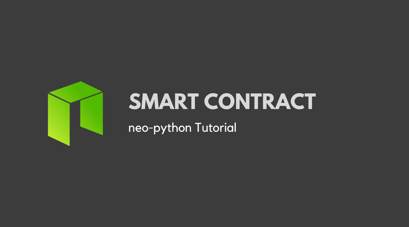

# Neo Smart Contracts Tutorials


### Required Packages:
`neo-boa` : for compile
`neo-python`: to interact with the NEO blockchain, build and deploy your contracts.


Use this command to start `neo-python`
```
np-prompt -p
```


* Official Sample 1: Hello World
```
neo> build {path}/smart-contracts/sample1.py test '' 01 False False
```
* Official Sample 2: Basic Computation
```
neo> build {path}/smart-contracts/sample2.py test 070202 02 False False add 1 2
```

* Official Sample 3: Balance Checker
```
neo> build {path}/smart-contracts/sample3.py test 070502 02 True False add AG4GfwjnvydAZodm4xEDivguCtjCFzLcJy 3
```

* Sample: Storage
```
build {path}/smart-contracts/sample-storage.py test 02 02 True True

```

* Sample: Timestamp
```
build {path}/smart-contracts/sample-timestamp.py test 02 02 True True
return: Current Linux TimeStamp
```
